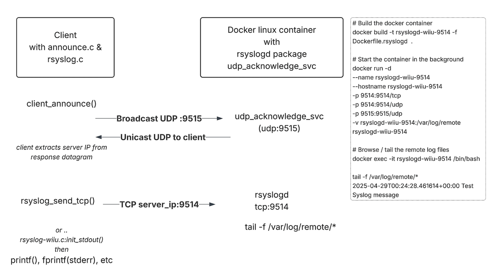

## Remote Syslog debugging

There are are two parts to this, 

* Syslog Server 
   - a standard linux rsyslog daemon runnining in a docker container.
   - (optional) a simple UDP service provides the IP of the rsyslog server
* Syslog Client 
   - simple libraries that write to rsyslogd over TCP.  Really this is just netcat
   - (optional) a simple UDP client libarary that sends a UDP broadcast, and captures the IP of the server response.



### Syslog Server

```
# Build the docker container
docker build -t rsyslogd-wiiu-9514 -f Dockerfile.rsyslogd  .

# Start the container in the background
docker run -d --name rsyslogd-wiiu-9514 --hostname rsyslogd-wiiu-9514 -p 9514:9514/tcp -p 9514:9514/udp -p 9515:9515/udp -v rsyslogd-wiiu-9514:/var/log/remote rsyslogd-wiiu-9514

# send a "remote" log line
echo "<14>Test Syslog message" | nc  localhost 9514

# Browse / tail the remote log files 
docker exec -it rsyslogd-wiiu-9514 /bin/bash

tail -f /var/log/remote/*
2025-04-29T00:24:28.461614+00:00 Test Syslog message
```

If you change the ports, be sure to change the -p arguments and the rsyslogd.conf file

A quick refresher on syslogd
* multi client UDP / TCP support
* simple clear text protocol
* line oriented
* Pretty UI integration
* log framework, with rotation, forwarding, aggregation, filtering

### Syslog Client

```
echo "<14>And I'd do it again" | nc  localhost 9514
```

or 
```

gcc -o test_rsyslogc rsyslog.c -I. test/test_rsyslog.c
./test_rsyslog
Sent to 127.0.0.1: <28> Apr 28 17:28:38 WIIU: This is a test message from my C program using TCP!
Syslog message sent successfully!
Sent to 127.0.0.1: <28> Apr 28 17:28:38 WIIU: An error occurred in the application!
Syslog message sent successfully!
```

```
# server side
root@118c5c18fbbe:/# tail -f /var/log/remote/*
2025-04-29T00:24:28.461614+00:00 Test Syslog message
2025-04-29T00:25:08.556891+00:00 And I'd do it again
2025-04-28T17:28:38+00:00 192.168.65.1 WIIU: This is a test message from my C program using TCP!
2025-04-28T17:28:38+00:00 192.168.65.1 WIIU: An error occurred in the application!
```

### Setting the Syslog IP in the client.
In order to log to the syslog server, the homebrew app needs the IP address of the 
docker container.

Option A:  pass the IP in a CFLAG 

```
-DSYSLOG_SERVER=192.168.0.67
```
and build your homebrew.


Option B: add the client library below.

### (optional)  udp client announce function

Add the following code to detect the IP address.  When called, the function will broadcast a UDP packet to servers listen on port 9515.  The client will read a response from the server, or timeout (currently 1 second).   

```
#include "announce.h"

    int port = 9515;   // the syslog server IP +1
    char server_ip_buffer[17];
    ... (add in a retry loop. currently read timeout = 1 second)
    res = client_announce(server_ip_buffer, port);
    printf("SERVER_IP=%s\n", server_ip_buffer);

```

### (optional)  udp server acknowledge service

A small 40 line service is configured to run in the docker instance.
The service will recieve the UDP packet on port 9515, and respond with 
a packet that contains it's IP.

Tiny, yet effective.  Just enough to provide the client a server IP without extra configuration steps.

```
nohup udp_acknowledge_svc > /tmp/udp_acknowledge_svc.log
```

This will die along with the syslog deamon when the Docker container shuts down.
